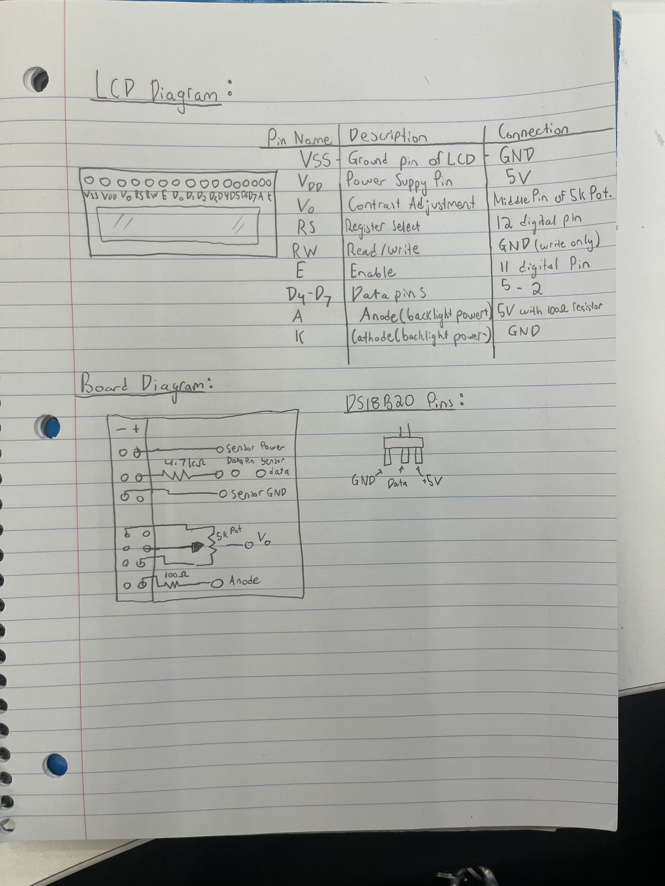

This is my Gecko's Temperature Sensor Build! This project is all about using a DS18B20 temperature sensor and a 16x2 LCD screen to display temperature readings for my Gecko Tails!

### Schematic
This covers the circuit diagram that shows how everything is connected together. 



### Temperature Test Video
This is a video of the temperature sensor in action. 
[Watch the Sensor Test Video](https://youtube.com/shorts/lencvRkwPpM?feature=share)


## Code
Here’s a very simple Arduino sketch that powers the entire setup. It reads the temperature from the DS18B20 sensor and displays it on the LCD.

```cpp
#include <OneWire.h>
#include <DallasTemperature.h>
#include <LiquidCrystal.h>

#define ONE_WIRE_BUS 7  //  DS18B20 data line
LiquidCrystal geckoLCD(12, 11, 5, 4, 3, 2); //Using LCD pins RS, E, D4-D7

OneWire oneWire(ONE_WIRE_BUS); //Controls sensor data
DallasTemperature sensors(&oneWire);

void setup() {
  Serial.begin(9600);        // Serial Monitor
  sensors.begin();           // DS18B20 sensor
  geckoLCD.begin(16, 2);     // 16x2 LCD screen
  geckoLCD.clear();          // Clear the LCD screen
}

void loop() {
  sensors.requestTemperatures();      // Command to get temperature
  float temperatureC = sensors.getTempCByIndex(0);  // Get temperature in Celsius

  geckoLCD.clear();                   // Clear the LCD for new readings
  geckoLCD.setCursor(0, 0);           // Set cursor to first row, first column
  geckoLCD.print("Temp: ");
  geckoLCD.print(temperatureC);
  geckoLCD.print(" C");
  

 //Convert to F
  float temperatureF = sensors.toFahrenheit(temperatureC);
  geckoLCD.setCursor(0, 1);           // Set cursor to second row, first column
  geckoLCD.print("Temp: ");
  geckoLCD.print(temperatureF);
  geckoLCD.print(" F");

  delay(1000);                        // Wait 1 second before next reading
}


